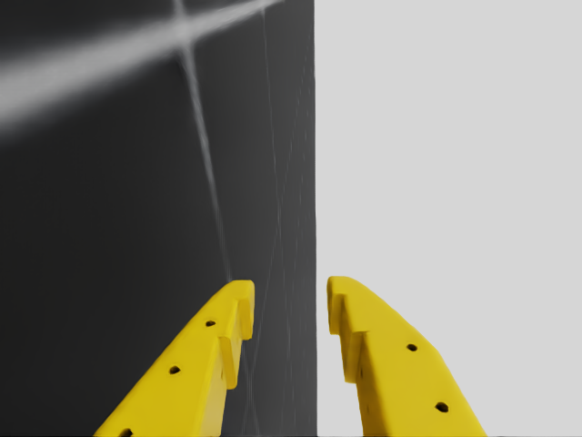

# Manus — SO-ARM101 in Isaac Lab

The SO-ARM101 arm — exact official CAD, as sold assembled (Amazon listing B0GT9BS7FZ) and
3-D printed — simulated in Isaac Lab 3.0 with per-motor joint control and a wrist-mounted
POV camera. No AI: structure and motor control only.




Third-person demo: the arm runs the scripted sequence while an exterior camera orbits it, wrist
POV inset in the corner. Full-quality video: [`media/demo_showcase.mp4`](media/demo_showcase.mp4).

## What's here

- `assets/so101/urdf/` — the **official** SO-101 URDF + 13 STL meshes, vendored verbatim from
  [TheRobotStudio/SO-ARM100](https://github.com/TheRobotStudio/SO-ARM100) (Apache-2.0,
  commit `7629d2a`; provenance + extracted ground truth in `assets/so101/UPSTREAM.md`).
- `assets/so101/usd/` — the same model converted to USD for Isaac Lab
  (regenerate: `convert_urdf.py <urdf> <out> --fix-base --joint-target-type position`, no
  `--merge-joints` so the `gripper_frame_link` tool frame survives).
  **After any regeneration, re-run `python scripts/fix_jaw_collision.py`**: the converter can
  only emit convex hulls, and the two jaws' hulls sit 6.6 mm (fixed) / 1.8 mm (moving) proud of
  their visual pad faces, so the sim clamps objects on an invisible surface until the jaws are
  patched back to SDF collision.
- `src/manus/specs.py` — sim-free ground truth: joint names/limits, Feetech bus map, servo specs.
- `src/manus/robot.py` — `SO101_CFG` (Isaac Lab `ArticulationCfg`), actuator gains =
  the vendor's system-identified STS3215 model from `joints_properties.xml`
  (kp 17.8, damping 0.60, friction 0.052, armature 0.028, ±3.35 N·m, 5.5 rad/s).
- `src/manus/scene.py` — ground + light + arm + `wrist_cam` (see below).
- `src/manus/control.py` — sim-free joint-space helpers (clamping, pose sequences, jog keymap),
  reusable unchanged on the real arm.

## Run it

All sim scripts use the Isaac Lab venv python. GPU is shared on this machine — check
`nvidia-smi` shows ≥6500 MiB free before render runs.

```bash
PY=~/isaaclab-env/bin/python

# Headless smoke test: loads scene, holds home pose, checks the wrist camera renders.
$PY scripts/smoke_test.py --headless

# Unit tests (sim-free, fast):
$PY -m pytest tests/

# Scripted pose demo; --video writes runs/demo_wrist_pov.mp4 (real-time wrist POV):
$PY scripts/demo_poses.py --headless --video

# GUI viewer versions (omit --headless):
$PY scripts/demo_poses.py
$PY scripts/teleop_keyboard.py     # keyboard jog, see key table at startup
```

Teleop keys (each press jogs 0.05 rad): `Q/A` shoulder_pan · `W/S` shoulder_lift ·
`E/D` elbow_flex · `R/F` wrist_flex · `T/G` wrist_roll · `Y/H` gripper · `ESC` quits.

The scripts force `enable_cameras` themselves — no extra flags needed.

## Joints ↔ Feetech bus (sim-to-real is 1:1)

Sim joint names and order equal the LeRobot SO-101 motor names and bus IDs, so joint-space
control code ports to the physical arm without remapping:

| Bus ID | Joint | Limits (rad) |
|---|---|---|
| 1 | `shoulder_pan` | ±1.920 |
| 2 | `shoulder_lift` | ±1.745 |
| 3 | `elbow_flex` | ±1.690 |
| 4 | `wrist_flex` | ±1.658 |
| 5 | `wrist_roll` | −2.744 … +2.841 |
| 6 | `gripper` | −0.175 … +1.745 |

Note on the real gripper: LeRobot normalizes it 0–100 (closed→open); the URDF/sim uses radians.

## Wrist camera (the claw's POV)

Rigidly mounted on `gripper_link` (the fixed jaw — it rides `wrist_roll` but not the jaw
open/close), pose taken verbatim from MuJoCo Menagerie's `robotstudio_so101` model
(Apache-2.0): offset `(0, 0.055, −0.045)` m, tilted −0.57 rad about X, looking just past the
fingertips into the grasp region. 640×480 RGB at 77.3° hFOV, matching the standard 32×32 mm
UVC wrist module run at its recommended 640×480 mode. One transform constant in
`src/manus/scene.py` adjusts it if the physical camera sits differently.

## Servo reality check (flagged for when the hardware arrives)

The reference SO-ARM101 uses Feetech STS3215 servos (7.4 V, 1/345). The **assembled Amazon
kit (B0GT9BS7FZ) is a Hiwonder build shipping HX-30HM (follower) / HX-10HM (leader) 12 V-class
bus servos** — same body size, same 4096-count encoders, same ~30 kg·cm torque class as the
12 V STS3215, but a different vendor stack (BusLinker V3.0 controller). The sim's actuator
model (vendor-calibrated, above) covers both; verify the servo protocol before writing the
real-hardware driver. Reference constants for both live in `src/manus/specs.py`.

## Isaac Lab 3.0 API notes (hard-won, spare yourself)

- `set_joint_position_target` is deprecated → `set_joint_position_target_index(*, target=...)`
  (keyword-only).
- `robot.data.*` returns `ProxyArray` — use `.torch` for a torch tensor.
- Quaternions in cfg offsets are `(x, y, z, w)` in this install.
- Cameras need `enable_cameras=True` on the AppLauncher (scripts here set it themselves).
- The URDF importer nests link Xforms by kinematic chain under `Robot/Geometry/...` — sensor
  prim paths must use the full chain.

## Not here yet (deliberately)

AI/policies, LeRobot integration, the real-hardware Feetech/Hiwonder bus driver, IK or
task-space control, third-person cameras.
